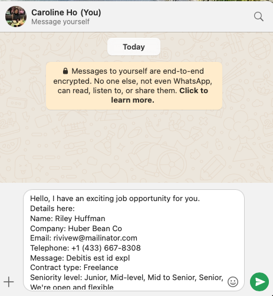

# 👔 Recruiter contact form

## Link to the live application: [here](https://job-contact-form.vercel.app/) !

### Full stack multi-step form

- Sends email to my mailbox
- Target is mostly companies, recruiters to offer
- User fills out the form, presses submit, email is sent to gmail account

## ⚙️ Tech Stack

- NextJS
- ReactJS
- JavaScript
- Chakra-UI
- Nodemailer
- NodeJS
- Vercel (deployment)

## 🔺 Features:

- Multi-step form
- Back & Next buttons for the navigation
- Graphical progress bar and page number to track the form filling journey
- Various diverse input types: Radio buttons, checkboxes, single-line input, multi-line text area, number input, range slider
- Input validation on typing and onBlur
- Submit button is greyed out until all the mandatory fields are filled out
- Success message after successful submission of the form
- Clears out form after successful submission
- Whatsapp chat using whatsapp api

➕ Bonus features to add later:

- Captcha validation
- IP Address tracking

## 📸 screenshots

### \_\_\_Page 1 desktop view

### \_\_\_Page 3 mobile view

### \_\_\_Page 2 tablet view

### \_\_\_Success message

### \_\_\_Example of received email

### \_\_\_Example of generated whatsapp message

